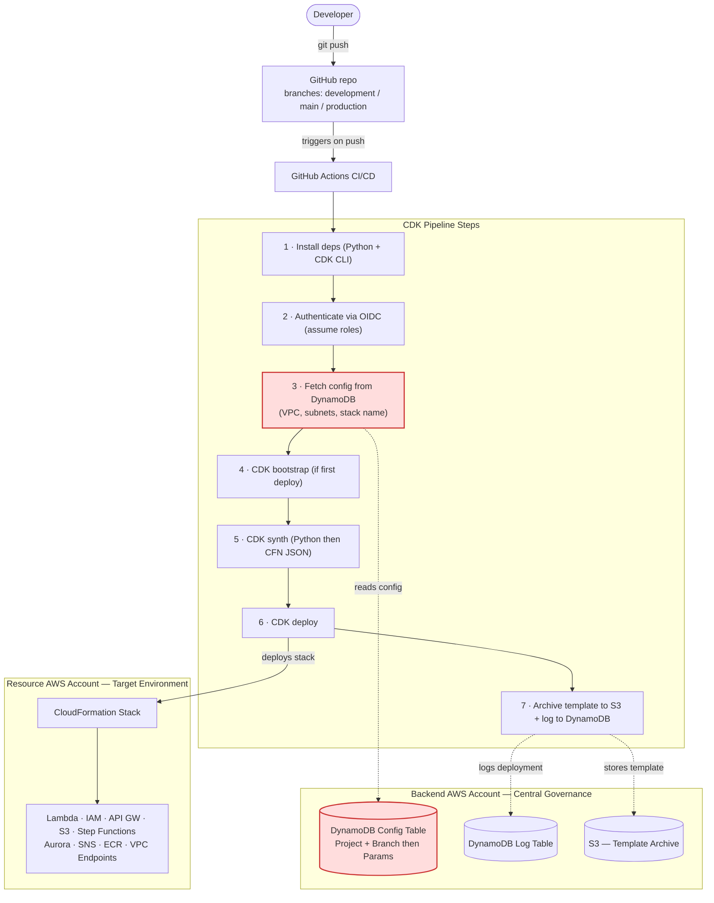
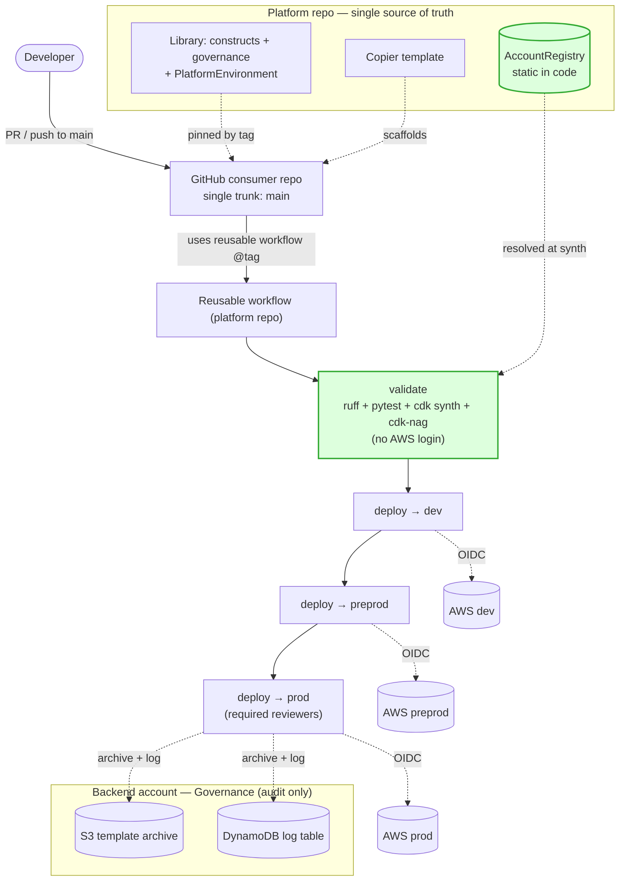
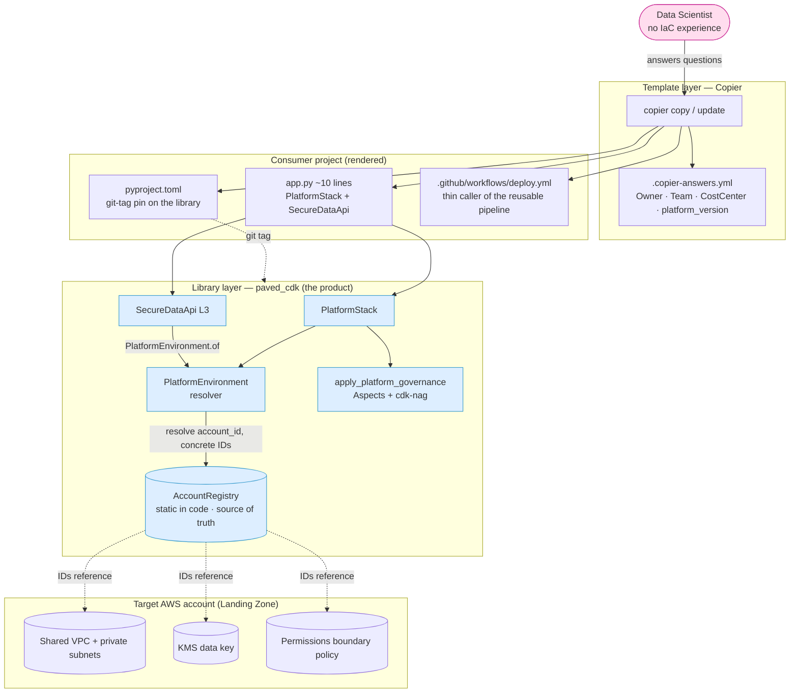
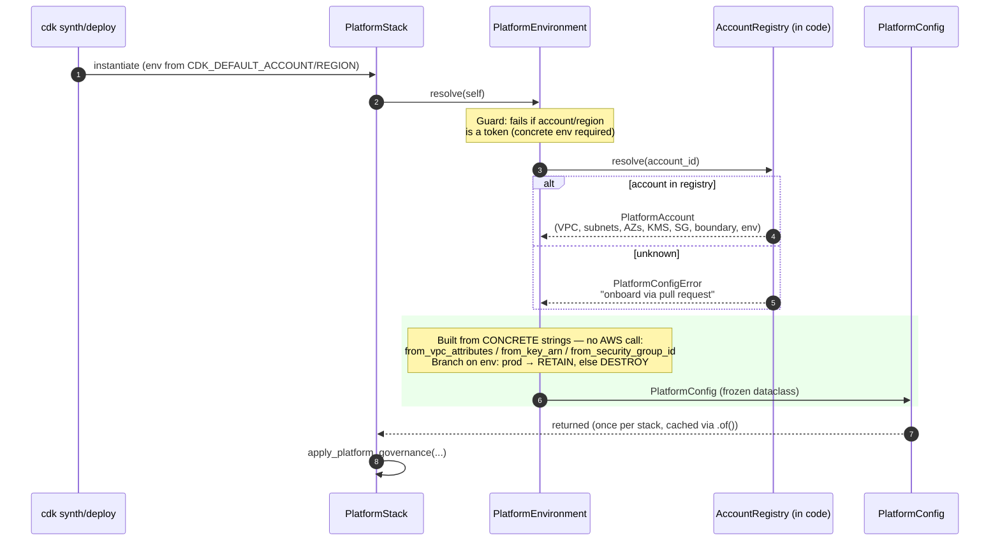
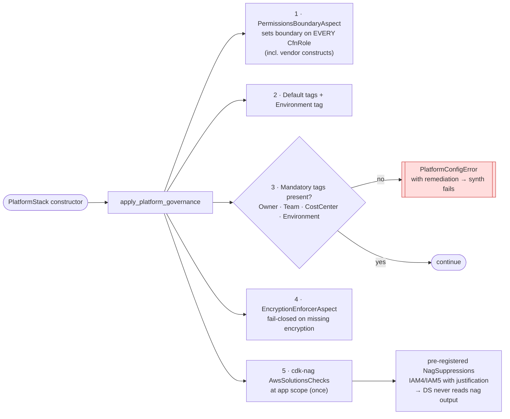
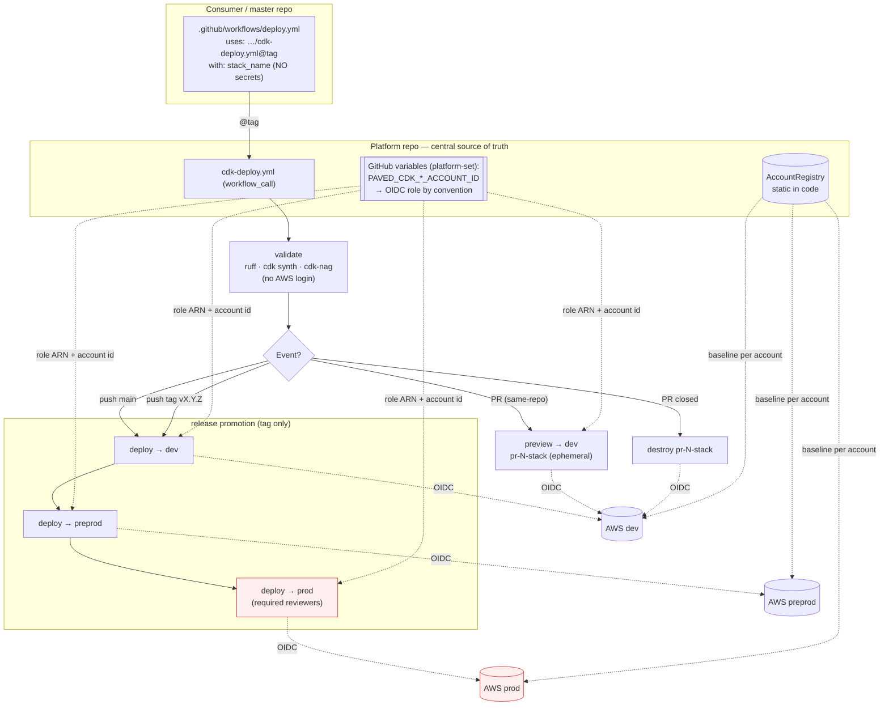
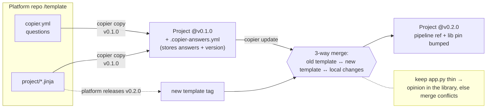
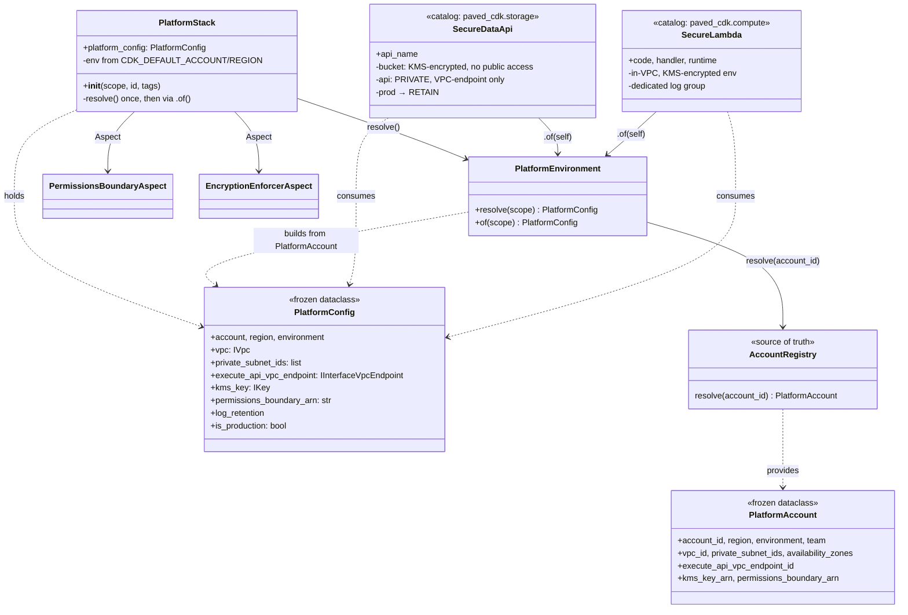
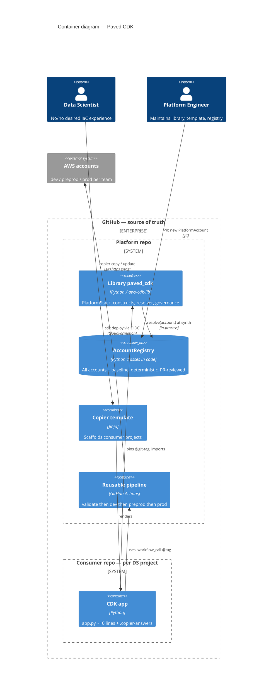
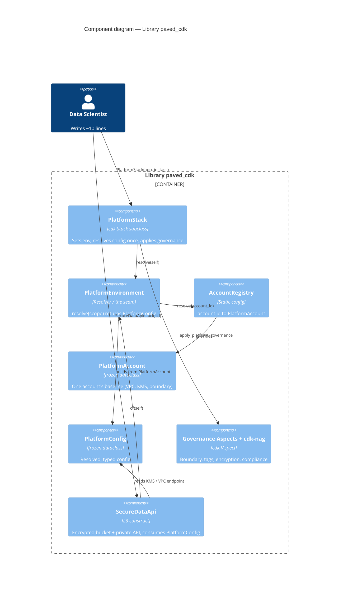

# Architecture — Paved CDK

Diagrams of the **currently built** architecture (reference PoC). Source of truth is the
code under `packages/paved_cdk/` and `template/`; the ADRs under `docs/adr/`
record the rationale.

> **Draw.io / diagrams.net:** every Mermaid diagram can be imported directly:
> `Arrange → Insert → Advanced → Mermaid…`, then paste the code block. The diagrams stay
> editable and live next to the code.
>
> **HLD with real AWS icons:** `docs/diagrams/paved-cdk-hld.drawio` — open in
> [app.diagrams.net](https://app.diagrams.net). Two pages (*As-Is* / *To-Be*) using the
> official AWS 2019 shape library (real Lambda/DynamoDB/S3/SageMaker/KMS/CloudFormation
> glyphs). Static exports for slides: `docs/diagrams/hld-as-is.png`,
> `docs/diagrams/hld-to-be.png`.
>
> Generated from `docs/diagrams/gen_hld.py` (diagrams-as-code). Regenerate the `.drawio`
> with `python3 docs/diagrams/gen_hld.py`. For PNGs, the `drawio` CLI `--page-index` flag is
> unreliable (it re-exports page 0); the robust recipe is to **split the multi-page file and
> export each single page**:
> ```bash
> python3 - <<'PY'
> import re, pathlib
> xml = pathlib.Path("docs/diagrams/paved-cdk-hld.drawio").read_text()
> for name, d in zip(["asis","tobe","repos"], re.findall(r"<diagram\b.*?</diagram>", xml, re.S)):
>     pathlib.Path(f"/tmp/page-{name}.drawio").write_text(f'<mxfile>{d}</mxfile>')
> PY
> drawio -x -f png --scale 2 -o docs/diagrams/hld-as-is.png            /tmp/page-asis.drawio  --no-sandbox
> drawio -x -f png --scale 2 -o docs/diagrams/hld-to-be.png            /tmp/page-tobe.drawio  --no-sandbox
> drawio -x -f png --scale 2 -o docs/diagrams/hld-repos-workflows.png  /tmp/page-repos.drawio --no-sandbox
> ```
> (Or open the `.drawio` in draw.io and `File → Export as → PNG` per page.)

---

## 1. HLD — As-Is vs To-Be

The two diagrams below are meant for a side-by-side, stakeholder-facing comparison.

### 1a. As-Is (current HLD)



**What undermines the design (red nodes + structure):**

1. **Config in DynamoDB, fetched at synth (step 3).** Non-deterministic (same commit can
   synth differently), a *second* source of truth outside Git, no PR/diff/test on config
   changes. It also reduces CDK to a templater fed by a table — which is exactly why "why
   even use CDK?" comes up.
2. **No validation/governance gate.** No `ruff` / `pytest` / `cdk-nag` step before deploy.
3. **Branch-per-environment** (development/main/production → DEV/TEST/PROD) invites drift
   between branches and merge pain.
4. **The platform itself is invisible** — only pipeline + config fetch are shown; the
   construct library, governance and the DS-facing interface (the actual product) are not.

### 1b. To-Be (target)



**What changes:** DynamoDB **config** table removed → static `AccountRegistry` in the repo
(deterministic, PR-reviewed); a **validate gate** (ruff + pytest + cdk-nag) runs before any
deploy, with **no AWS login** because synth is offline; **branch-per-env → single trunk +
stage promotion** (dev → preprod → prod via GitHub Environments); the **library + Copier
template** are first-class. The DynamoDB **log** table and S3 **template archive** stay —
that is a legitimate audit trail.

---

## 2. Three-layer overview

What the Data Scientist touches, what the platform does automatically, and where the
account-specific values come from.



**Key point:** the DS declares *what* they want (a notebook). *How* (VPC, subnet, KMS, IAM
boundary, tags, compliance) is resolved by the library from the account. No `vpc=`, `env=`,
`kms=` in user code.

---

## 3. Deterministic config resolution (static registry)

The subtlest and most important part: how the target account becomes the typed
`PlatformConfig` — **deterministically, without AWS access** (ADR 0008).



Same commit → same template. Each field of a `PlatformAccount` flows into the template via
a CDK importer, no lookup:

| Field (`PlatformAccount`) | Used by | Result in the template |
|---|---|---|
| `vpc_id`, `private_subnet_ids`, `availability_zones` | `Vpc.from_vpc_attributes` | `IVpc`, concrete subnet ids |
| `execute_api_vpc_endpoint_id` | `InterfaceVpcEndpoint.from_interface_vpc_endpoint_attributes` | `IInterfaceVpcEndpoint` (private API) |
| `kms_key_arn` | `Key.from_key_arn` | `IKey`, concrete key id |
| `permissions_boundary_arn` | set by `PermissionsBoundaryAspect` | ARN on **every** `CfnRole` |
| `environment` | branch in the resolver | `prod → RemovalPolicy.RETAIN`, log retention, `Environment` tag |

> The only SSM-like element in a synthesized template is CDK's own `BootstrapVersion`
> parameter — unavoidable and unrelated to our config.

> **Account ids come from the environment.** To keep real account numbers out of the repo,
> `account_id` is read per stage from `PAVED_CDK_{DEV,PREPROD,PROD}_ACCOUNT_ID` (placeholder
> fallback for offline import/tests), and the KMS/boundary ARNs are *built* from the resolved
> id. The rest of the baseline stays static. Resolution is still deterministic for a given
> environment — the env vars are set once per deploy target, not fetched at synth.

---

## 4. Governance every stack gets

`apply_platform_governance(stack, cfg, tags)` — guardrails enforced in code, not by docs or
discipline (ADR 0005).



---

## 5. Uniform pipeline — event-driven, 3 stages, platform-owned auth (ADR 0011)

One reusable workflow; the master and every consumer call it with a thin caller pinned by
`@tag` (ADR 0007). The event decides what happens; the Data Scientist sets **nothing
AWS-specific**.



**Mechanics:**
- **dev** gets every `main` push; **preprod & prod only a release tag** `vX.Y.Z` (prod with
  Required Reviewers). A **PR** gets a live, ephemeral `pr-<n>-<slug>` preview in **dev**
  (same-repo only), destroyed when the PR closes — the prefix comes from `STACK_PREFIX`, which
  `PlatformStack` applies transparently.
- **Deploy auth is platform-owned:** per-stage account ids are GitHub **variables**
  (not secrets), the OIDC role ARN is derived by convention; the same ids feed the registry so
  synth resolves the baseline. The thin caller passes **no secrets and no AWS config**.
- Pipeline updates = bump the `@tag` in the caller (via `copier update`).

---

## 6. Template distribution & update propagation (Copier)

Why Copier over Cookiecutter: `copier update` pulls platform improvements into existing
projects via a 3-way merge.



**Library distribution** (no CodeArtifact, ADR 0006): the rendered `pyproject.toml` pins the
library directly by git tag —
`[tool.uv.sources] paved-cdk = { git = …, tag = "v0.1.0", subdirectory = … }`.
`copier update` bumps this tag in lockstep with the pipeline tag.

---

## 7. Library components (class / module view)



> **Catalog pattern:** constructs are an à-la-carte catalog (namespaced
> `paved_cdk.storage` / `paved_cdk.compute`). A consumer instantiates only what it needs;
> importing the library deploys nothing (*instantiation ≠ deployment*). `SecureLambda` shows
> the "secure envelope vs filling" split — the library wraps the resource securely, the
> workload supplies the code via `Code.from_asset(...)`. See [building-blocks](building-blocks.md).

---

## 8. C4 — Container diagram (static account registry, GitOps)

The current architecture: GitHub as source of truth, static registry, deterministic.



> Note: `AccountRegistry` is drawn as a separate "ContainerDb" to stress its role as the
> *data source* — technically it is a module **inside** the library.

## 9. C4 — Component diagram (inside the library)

How resolution is wired internally — the single seam `PlatformEnvironment`.



---

## Known sharp edges (carry these honestly into the presentation)

- **Default-VPC PoC baseline** — the example registry is verified offline (8 tests green)
  and was deployed end-to-end into a `dev` account (private API + KMS bucket + boundary +
  tags confirmed on real infra). The baseline is wired to the account's **default VPC**;
  a real deployment uses dedicated private subnets. Account ids are read from environment
  variables (`PAVED_CDK_{DEV,PREPROD,PROD}_ACCOUNT_ID`), with placeholders as fallback.
- **The registry must stay in sync with reality** — baseline values now live in code, not
  live in SSM. If the LZ rotates a subnet/KMS, a PR must update the registry, and consumers
  pick it up only via `copier update` (pull, not automatic). Mitigation: generate the
  registry from AWS Organizations in CI + a freshness gate in the pipeline that flags stale
  pins.
- **VPC endpoints are a prerequisite** — a notebook with `internet=Disabled` is only usable
  with interface endpoints (`sagemaker.api/.runtime/.notebook`), an S3 gateway, and egress
  rules to the package source. Otherwise: creatable but no `pip`/`uv install`.
- **`copier update` not yet exercised** — the real USP over Cookiecutter is unproven until a
  v1→v2 merge is tested.
- **SageMaker notebook instances are effectively legacy** — fine as a wiring demo; SageMaker
  Studio would be the more realistic paved road.
```

