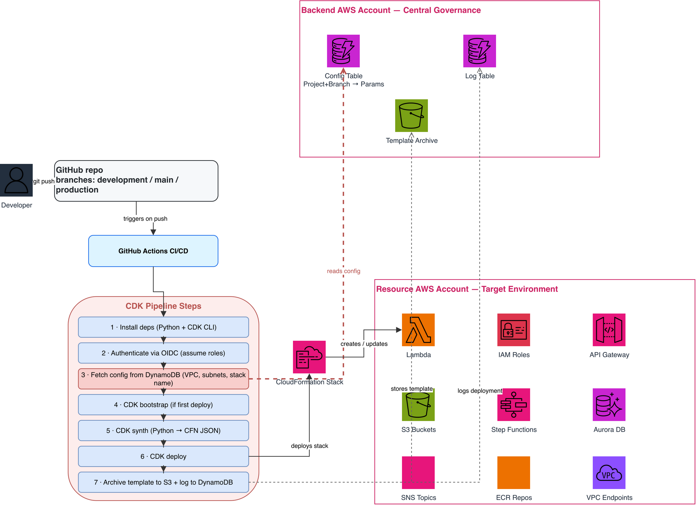
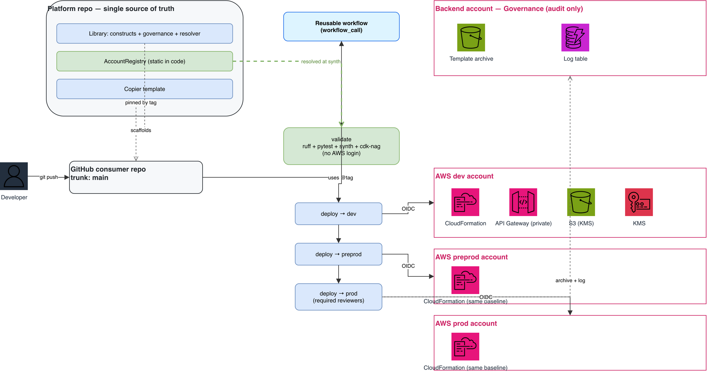
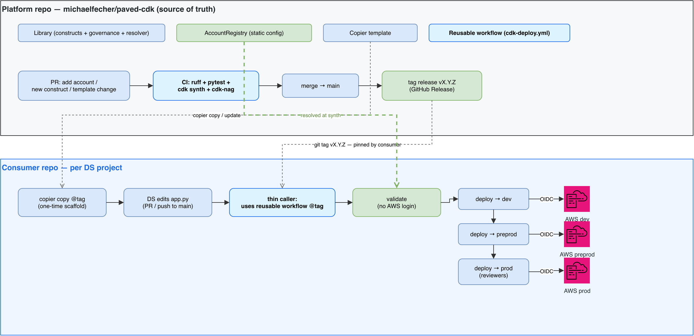

# Building Blocks & Workflows — Paved CDK

This document describes **each building block** the platform is made of — what it is, how
it is built, where it lives in the code, and why — and embeds the high-level diagrams.

- Conceptual / logical diagrams (Mermaid): see [`architecture.md`](architecture.md).
- Decision records: see [`adr/`](adr/).
- Editable icon source: [`diagrams/paved-cdk-hld.drawio`](diagrams/paved-cdk-hld.drawio)
  (open in [app.diagrams.net](https://app.diagrams.net); regenerate via
  `python3 docs/diagrams/gen_hld.py`).

---

## Diagrams

### As-Is (current) vs To-Be (target)

The current design fetches per-deployment config from DynamoDB at synth time (red);
the target keeps config as a static, version-controlled registry and adds a validate gate.

**As-Is**

**To-Be**

### Repository & workflow process

How the two repositories and their workflows interlock — the platform repo (release of
library + template + registry) and each consumer repo (scaffold → PR → shared pipeline →
dev/preprod/prod).

---

## Building blocks

Each block lists **What · How it's built · Where · Why**.

### AccountRegistry — the source of truth
- **What:** the single, in-code registry of every managed AWS account and its baseline.
- **How it's built:** a module holding a tuple `_ACCOUNTS` of `PlatformAccount` instances.
  `AccountRegistry` indexes them by `account_id` into a dict (rejecting duplicates) and
  exposes `resolve(account_id)`, which returns the `PlatformAccount` or raises a
  `PlatformConfigError` naming the remediation ("onboard via pull request"). A module-level
  `DEFAULT_REGISTRY` is what production resolves against. **Onboarding an account = a pull
  request adding one `PlatformAccount` entry**, validated by CI (schema + a deterministic
  `cdk synth`) before merge.
  **Account ids** are not committed: each stage reads its id from an env var
  (`PAVED_CDK_{DEV,PREPROD,PROD}_ACCOUNT_ID`) with an offline placeholder fallback, and the
  KMS/boundary ARNs are derived from the resolved id — so no real account number lives in the
  repo. The rest of the baseline (VPC, subnets, KMS key id, endpoint) is static.
- **Where:** `packages/paved_cdk/src/paved_cdk/registry.py`
- **Why:** deterministic, version-controlled, PR-reviewable; replaces the SSM/DynamoDB
  lookup (ADR 0008). GitHub stays the single source of truth.

### PlatformAccount — one account's baseline
- **What:** the typed baseline a single AWS account exposes to the platform.
- **How it's built:** a `@dataclass(frozen=True)` with `account_id`, `region`,
  `environment`, `team`, `vpc_id`, `private_subnet_ids` (tuple), `availability_zones`
  (tuple), `execute_api_vpc_endpoint_id`, `kms_key_arn`, `permissions_boundary_arn`.
  `__post_init__` validates fail-fast (12-digit account id, `environment ∈ {dev,preprod,prod}`,
  non-empty subnets); an `is_production` property drives branching. Tuples (not lists) keep
  it hashable and immutable.
- **Where:** `account.py`
- **Why:** a typed, validated record beats opaque config rows — errors surface at synth with
  a clear message, and the data is reviewable in a diff.

### PlatformEnvironment — the resolver (the one seam)
- **What:** turns the target account into a typed `PlatformConfig`. The single place where
  "where config comes from" is decided.
- **How it's built:** `resolve(scope, registry=DEFAULT_REGISTRY)` guards that the stack's
  account/region are concrete (not CDK tokens), looks the account up via
  `registry.resolve(stack.account)`, then builds the CDK objects **from concrete strings** —
  `Vpc.from_vpc_attributes`, `SecurityGroup.from_security_group_id`, `Key.from_key_arn` —
  none of which call AWS. `of(scope)` returns the config already cached on the enclosing
  `PlatformStack` (so resolution happens once per stack).
- **Where:** `environment.py`
- **Why:** constructs only ever see `PlatformConfig`; swapping the config backend later is a
  one-module change. Resolution is offline and deterministic.

### PlatformConfig — the resolved config
- **What:** the typed, account-specific configuration every construct consumes.
- **How it's built:** a `@dataclass(frozen=True)` (`account`, `region`, `environment`,
  `vpc: IVpc`, `private_subnet_ids`, `execute_api_vpc_endpoint: IInterfaceVpcEndpoint`,
  `kms_key: IKey`, `permissions_boundary_arn`, `log_retention`, `default_tags`) with an
  `is_production` property. Produced only by `PlatformEnvironment`; Data Scientists never
  build it by hand.
- **Where:** `config.py`
- **Why:** a single typed object keeps account specifics out of user code (`no vpc=/env=/kms=`).

### PlatformStack — the base stack (delivery vehicle for the baseline)
- **What:** the stack a Data Scientist instantiates; inheriting it delivers the whole baseline.
- **How it's built:** subclass of `cdk.Stack`. `__init__` wires `env` from
  `CDK_DEFAULT_ACCOUNT/REGION` (or an explicit `env`), applies the caller's governance tags,
  resolves `self.platform_config` once via `PlatformEnvironment.resolve`, then calls
  `apply_platform_governance(self, cfg, tags)`. Constructs reuse the cached config via
  `PlatformEnvironment.of`.
- **Where:** `stacks/platform_stack.py`
- **Why:** the DS gets environment wiring + governance + resolved config by writing one line.

### Governance — guardrails applied to every stack
- **What:** permissions boundary, mandatory tags, fail-closed encryption, and cdk-nag —
  enforced in code, not by docs.
- **How it's built:** `apply_platform_governance` (1) adds `PermissionsBoundaryAspect`, an
  `IAspect` that sets `permissionsBoundary` on **every** `CfnRole` (including those created
  inside vendor constructs); (2) adds platform default tags + the `Environment` tag;
  (3) validates the mandatory tags `Owner/Team/CostCenter/Environment`, raising
  `PlatformConfigError` (synth fails) if any are missing; (4) adds `EncryptionEnforcerAspect`
  (fail-closed on unencrypted resources); (5) registers cdk-nag `AwsSolutionsChecks` once at
  app scope plus pre-approved `NagSuppressions` (IAM4/IAM5, with written justification) so the
  DS never reads nag output.
- **Where:** `aspects/governance.py`, `aspects/permissions_boundary.py`,
  `aspects/encryption_enforcer.py`
- **Why:** governance that can't be forgotten — it runs whether or not the DS knows it exists.

### SecureDataApi — the reference L3 construct
- **What:** an encrypted S3 data bucket plus a **private** REST API Gateway — the example
  paved-road brick, showing both data-at-rest and private-networking defaults.
- **How it's built:** a `Construct` that reads `PlatformConfig` via
  `PlatformEnvironment.of(self)` and creates (1) an `s3.Bucket` encrypted with the account
  KMS key, public access blocked, TLS-only, `RETAIN` in prod; and (2) an `apigateway.RestApi`
  with `EndpointType.PRIVATE` associated to the account's `execute-api` interface VPC
  endpoint, plus a resource policy that **denies** any invocation whose `aws:SourceVpce` is
  not that endpoint — so the API resolves and is callable only privately inside the VPC, with
  no public internet path. The IAM execution roles get the permissions boundary centrally via
  the aspect. The **only** public knob is `api_name`.
- **Where:** `constructs/secure_data_api.py` (catalog namespace `paved_cdk.storage`)
- **Why:** demonstrates the pattern — secure-by-default, account-aware, near-zero DS input —
  on resources Data Scientists actually use (a data bucket + a private service endpoint).

### SecureLambda — paved-road compute brick
- **What:** an in-VPC, KMS-encrypted Lambda; the DS supplies only the code/handler/runtime.
- **How it's built:** a `Construct` that reads `PlatformConfig` and creates a
  `_lambda.Function` placed in the account's private subnets, with `environment_encryption`
  set to the account KMS key, a dedicated `logs.LogGroup` at the account retention, and the
  execution role bounded centrally by the aspect. `code` is an **input** —
  `Code.from_asset("src/...")` references the *consumer repo's* code. Only `L1` is suppressed
  (deliberately pinned runtime).
- **Where:** `compute/secure_lambda.py` (catalog namespace `paved_cdk.compute`)
- **Why:** the "secure envelope vs filling" pattern — the library provides the secure wrapper
  (network, KMS, role, logs), the workload provides the business logic. Application code can't
  be pre-baked, but everything around it is.

### Catalog & modularity — how bricks are consumed
- **What:** the constructs form an **à-la-carte catalog**, like `aws-cdk-lib` itself.
- **How it's built:** bricks are namespaced (`paved_cdk.storage`, `paved_cdk.compute`) and
  re-exported at the top level. A consumer imports and **instantiates only what it needs** —
  importing the library does **not** deploy anything; only an instantiated construct lands in
  the template (*instantiation ≠ deployment*). `PlatformStack` + governance are the mandatory
  paved road; the bricks are opt-in.
- **Where:** `paved_cdk/storage/`, `paved_cdk/compute/`, top-level `__init__.py`
- **Why:** modular like CDK; teams pull only the resources they use. New bricks ship in a
  library version bump; consumers adopt them by adding one line.

### Copier template — the Data-Scientist interface
- **What:** scaffolds a ready-to-run CDK project from a few answers.
- **How it's built:** `copier.yml` asks `project_name`, `project_slug`, `owner_email`,
  `team`, `cost_center`, `platform_repo`, `platform_version`. It renders
  `template/project/*.jinja` into a project: `app.py` (tags injected from answers),
  `pyproject.toml` (pins the library by git tag), `cdk.json`, a thin `deploy.yml` caller, and
  `.copier-answers.yml` (records answers + template version). `copier update` re-renders
  against a newer template tag via a 3-way merge.
- **Where:** `template/`
- **Why:** the DS declares intent and gets a working, governed project — no IaC assembly.

### Reusable workflow — the uniform pipeline
- **What:** the single shared CI/CD pipeline all DS projects run.
- **How it's built:** `.github/workflows/cdk-deploy.yml` (`workflow_call`). Jobs: **validate**
  (ruff + `cdk synth` + cdk-nag, **no AWS login** — synth is offline), **diff** (sticky PR
  comment), **deploy-dev → deploy-preprod → deploy-prod** (sequential), each bound to a GitHub
  Environment holding that account's OIDC `AWS_DEPLOY_ROLE_ARN` and protection rules
  (required reviewers on prod). No long-lived AWS keys. **Hardened (ADR 0010):** third-party
  actions pinned to commit SHAs; the `diff` job is gated to same-repo PRs (no fork access to
  the deploy role); the posted diff is account-id-redacted; the workflow declares the
  `AWS_DEPLOY_ROLE_ARN` secret explicitly.
- **Where:** `.github/workflows/cdk-deploy.yml`
- **Why:** "uniformity by reference" — every project's pipeline is identical and updated
  centrally by bumping one `@tag`.

### Consumer thin caller + git-tag distribution
- **What:** how a consumer repo wires into the pipeline and the library.
- **How it's built:** the rendered `.github/workflows/deploy.yml` is a thin caller —
  `uses: <platform_repo>/.github/workflows/cdk-deploy.yml@<tag>`, passing **only**
  `AWS_DEPLOY_ROLE_ARN` (not `secrets: inherit`). The rendered `pyproject.toml` pins the
  library via `[tool.uv.sources]` to the GitHub repo + tag + subdirectory (no CodeArtifact;
  ADR 0006). `copier update` bumps both the workflow `@tag` and the library pin together.
  (Copier consumes the template from the **repo root** `copier.yml` via git tag — see the
  [workload runbook](workload-runbook.md).)
- **Where:** `template/project/.github/workflows/deploy.yml.jinja`,
  `template/project/pyproject.toml.jinja`
- **Why:** consumers carry almost nothing of their own; behaviour comes from the pinned
  platform version and moves forward in lockstep on `copier update`.
