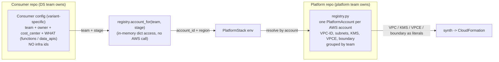

# Configuration: per account, per team, per consumer

Configuration lives in **two layers**, both static Python/YAML in git, maintained by
**pull request**, with **no DynamoDB / SSM / runtime lookup**. This is the deliberate
replacement for the customer's current Dynamo-at-runtime approach (see ADR 0008, 0012).



The point: **infra ids live only in the registry (per account). The consumer names its
team and what it wants - never a VPC, KMS key or account id.**

## Layer 1 - account / team baseline (`packages/paved_cdk/src/paved_cdk/registry.py`)

One `PlatformAccount` per AWS account, grouped by team. Each team has three accounts
(dev/preprod/prod). This is where the pre-provisioned references live; account ids come
from per-team env vars (placeholders for offline/public).

```python
_account(
    "ds", "dev", "111111111111",
    vpc_id="vpc-0c867bce9f2e26b50",
    subnets=("subnet-0c170a7b7245d3384", "subnet-0aaff7625fecf62a0", "subnet-0effb74af1e4a9ec2"),
    vpce="vpce-02322cfeb68fa0bbf",
    kms_key_id="a6953c24-56c8-4cbe-b5a9-5eac7ad2a093",
)
# ... ds preprod, ds prod, then the next team:
_account(
    "marketing", "dev", "444444444444",
    vpc_id="vpc-0a11b22c33d44e550",          # marketing's own dev VPC
    subnets=("subnet-0a11d00000000001", "subnet-0a11d00000000002", "subnet-0a11d00000000003"),
    vpce="vpce-0a11e00000000001",
    kms_key_id="11111111-1111-1111-1111-111111111111",
)
```

Resolution helpers: `account_for(team, stage)`, `accounts_for_team(team)`, `teams`.
**Onboarding a team = one PR** adding its three `_account(...)` rows + setting the three
`PAVED_CDK_<TEAM>_<STAGE>_ACCOUNT_ID` repo variables.

Note on the "lookup": `account_for(...)` is a plain in-memory dict access, and
`Vpc.from_vpc_attributes(vpc_id=...)` downstream is **not** an AWS call - it bakes the id
into the template as a literal. There is no synth-time network/credential dependency. That
is exactly what makes it deterministic and reviewable, unlike a Dynamo/SSM read.

## Layer 2 - consumer config (variant-specific, in the consumer repo)

The consumer names its `team` (+ owner/cost_center) and declares its resources. **Never**
an infra id. Naming the team selects the three accounts; the stage (set by the pipeline,
default `dev` locally) selects which of them, and the registry supplies the baseline.

### explicit / Copier (`main`) - `app.py`
```python
stack = PlatformStack(
    app, "scoring-service",
    team="ds",                                   # <- selects the account baseline
    tags={"Owner": "alice@example.com", "CostCenter": "4711"},
)
SecureDataApi(stack, "Data", props=SecureDataApiProps(api_name="scoring-data"))
SecureLambda(stack, "Score", props=SecureLambdaProps(code=Code.from_asset("src/score")))
```

### SDK (`feat/sdk`) - `app.py` + `handlers/`
```python
# app.py
synth(service="scoring-service", team="ds",
      tags={"Owner": "alice@example.com", "CostCenter": "4711"})
# handlers/score.py:  data_api("scoring-data");  @function def score(...)
```

### declarative (`feat/declarative`) - `service.yaml`
```yaml
service_id: scoring-service
owner: alice@example.com
team: ds                       # <- selects the account baseline
cost_center: "4711"
data_apis: [scoring-data]
functions:
  - name: score
```

Proof it binds: the **same** consumer code with `team="ds"` synthesizes against
`vpc-0c867bce9f2e26b50`; with `team="marketing"` against `vpc-0a11b22c33d44e550` - resolved
from the registry, nothing changed in the consumer except the team name.

Multiple consumers can share one team's three accounts; each gets its own stack
(`stack name = service_id`).

## Maintenance - pull requests only, never Dynamo

| What changes | Where the PR lands | Validation before merge |
|---|---|---|
| Account baseline (VPC, subnet, KMS), onboard a team - **rare** | platform repo `registry.py` | CI: `PlatformAccount.__post_init__` checks + offline synth must pass |
| Consumer resources (a Lambda, a data_api) | consumer repo (`app.py` / `handlers/` / `service.yaml`) | consumer CI: synth + tests |
| Onboard a consumer | **one** PR opened by the platform into the consumer repo (Copier scaffold, team pre-filled) | review in the consumer repo |

Why not DynamoDB (the explicit ask): a runtime table read makes synth non-deterministic
(the value can change between synth and deploy), needs credentials and network (no offline
synth), has no review/diff, and drifts from the code that uses it. The in-code registry is
the inverse: same commit -> same config, readable PR diff, offline-synthable, git as the
single source of truth. The lookup moves from "runtime against AWS" to "compile-time
against git".
