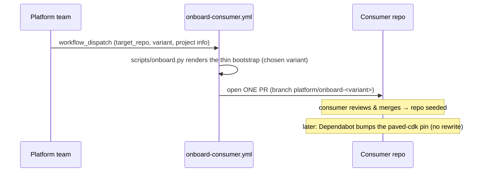

# Consumer onboarding — the platform writes once, via a PR

A consumer repo is seeded **once** by the platform, as a **single automated PR** — no
hand-copying, for any variant. After that, the platform never writes to the repo again;
updates are dependency **pin bumps** and the consumer's runtime code is never overwritten.



## What gets written (once)
Only a **thin, consumer-owned bootstrap** — never the platform code (that stays a pinned
dependency). Per variant:

| Variant | Bootstrap files |
|---|---|
| **sdk** | `app.py` (`synth()`), `handlers/` (sample), `notebooks/`, `cdk.json`, `deploy.yml`, `pyproject.toml` |
| **declarative** | `service.yaml`, `handlers/`, `notebooks/`, `cdk.json` (`paved-cdk-synth`), `deploy.yml`, `pyproject.toml` |
| **copier** | `app.py` (explicit `ServiceSpec`), `handlers/`, `notebooks/`, `cdk.json`, `deploy.yml`, `pyproject.toml` |

## How to run it
- **Platform side:** Actions → *onboard-consumer* → Run workflow → pick `target_repo` +
  `variant` + project info. Needs a secret `ONBOARDING_TOKEN` (PAT/App with
  `contents:write` + `pull-requests:write` on the target repos).
- **Target repo** must be **initialized** (a `main` branch — e.g. `gh repo create … --add-readme`).
- **Local dry-run** (same renderer, no PR):
  ```bash
  python scripts/onboard.py --variant sdk --out /tmp/bootstrap \
    --project-name "Payments" --service-id f-payments --owner team@example.com
  ```

## Guarantees
- **No manual copying** — `onboard.py` + the workflow do it; consumers never copy platform files.
- **No overwrite of runtime code** — the PR skips existing `handlers/`, `notebooks/`, `app.py`,
  `service.yaml`; and the platform itself is a dependency, never vendored.
- **Same for all variants** — one PR seeds the repo regardless of the chosen consumption model.
